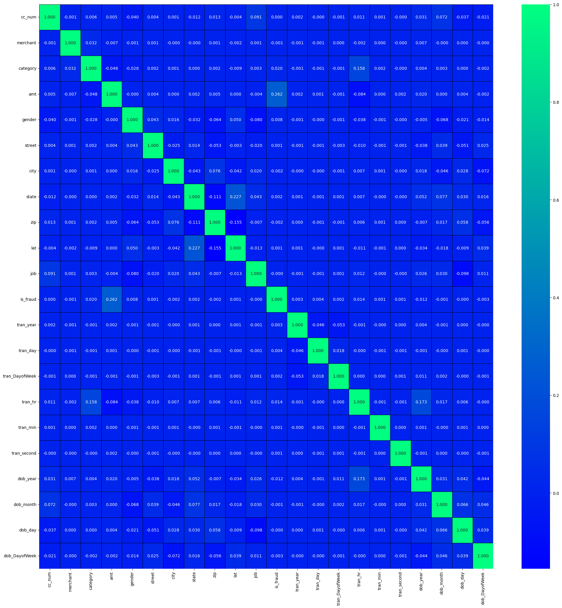

# Credit Card Fraud detector Model Repository

Welcome to the Credit Card Fraud Detector Model Repository! This repository contains a  machine learning model trained on an real-time dataset. In this README, you'll find everything you need to know about the model, the dataset, and how to use them effectively.

## Table of Contents

- [Introduction](#introduction)
- [Model Overview](#model-overview)
- [Dataset](#dataset)
- [Getting Started](#getting-started)
- [Usage](#usage)
- [Results](#results)
- [Contributing](#contributing)
- [License](#license)

## Introduction

The repository contains the model which detects a fraudulent credit card detection and a web application of it. It solves the problem of fraudulent transaction which is a big problem in the economic industry.
The dataset used is a real-time dataset derived from an extensive survey and sourced from kaggle platform.

## Model Overview

This Model is designed as a Random Forest Regressor, a powerful ensemble learning technique for regression tasks. It consists of an ensemble of multiple decision trees, each trained on a random subset of the training data. The predictions of these individual trees are aggregated to make the final prediction.
# Components
1. Decision Trees: The core building blocks of the Random Forest Regressor. Each decision tree learns a set of rules to split the data into smaller subsets based on the features, aiming to minimize the variance of the target variable within each subset.
2. Ensemble Aggregation: The model aggregates predictions from multiple decision trees to make the final prediction. This aggregation reduces overfitting and improves the overall accuracy of the model.
# Key Features
1. Feature Importance: The model automatically measures the importance of each feature during training. This allows us to gain insights into which features are most influential in making accurate predictions.

2. Non-Linearity Handling: The Awesome Model is adept at capturing complex non-linear relationships within the data due to the ensemble of decision trees. This enables it to model intricate patterns that might be missed by simpler linear models.

3. Robustness: The ensemble nature of the model makes it robust to noise and outliers in the dataset. It can generalize well to unseen data points, reducing the risk of overfitting.

4. Hyperparameter Tuning: The model's hyperparameters, such as the number of trees (n_estimators), maximum depth of trees (max_depth), and minimum samples per leaf node (min_samples_leaf), have been tuned to strike a balance between bias and variance, ensuring optimal performance.

## Dataset

Explain the dataset used to train and evaluate the model. Provide details about the data sources, size, format, and any preprocessing steps applied. If possible, showcase some sample data points or visualizations.

The dataset used to train and evaluate this  Model is a curated collection of [Credit_Card_transactions], designed to tackle the [Credit_Card_fraud_detection] task. This section provides an overview of the dataset, its sources, preprocessing steps, and sample data points.

# Data Sources
The dataset is sourced from [Kaggle], a reputable repository of [Credit_card_transactions]. It was carefully selected due to its relevance to the problem at hand and its quality in terms of accuracy and diversity.

# Size and Format
The dataset contains a total of [1296675] instances, each with [34] features. The data is stored in [csv], with each instance represented as a row and each feature as a column.

# Preprocessing Steps
Before training the Awesome Model, the dataset underwent a series of preprocessing steps to ensure optimal model performance:

1. Data Cleaning: Any missing or erroneous values were carefully addressed. Depending on the feature, missing values were either imputed or instances were removed.

2. Feature Scaling: Numerical features were scaled using [Scaling Method] to bring them to a similar scale, preventing any one feature from dominating the learning process.

3. Categorical Encoding: Categorical features were one-hot encoded to convert them into a format suitable for machine learning algorithms.

4. Balancing the DataSet: The Imbalanced Data was balanced using Random UnderSampling of the minority samples so as to get the accurate model

5. Train-Test Split: The dataset was split into a training set (80%) and a testing set (20%) to evaluate the model's performance on unseen data.

# Data Visualisation

*Figure 1: Correlation Heatmap*

The heatmap provides insights into how different features are correlated with each other, which can be helpful for understanding potential patterns and relationships in the data.

*Figure 5: Balanced Target Variable Bar Plot*

The bar plot provides an overview of the distribution of the target variable, helping you understand the balance of classes and potential class imbalances in the dataset.
